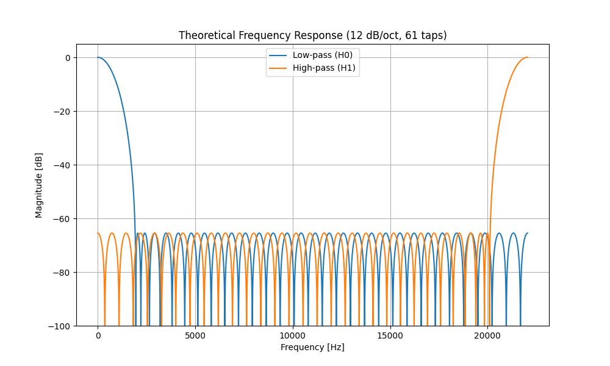
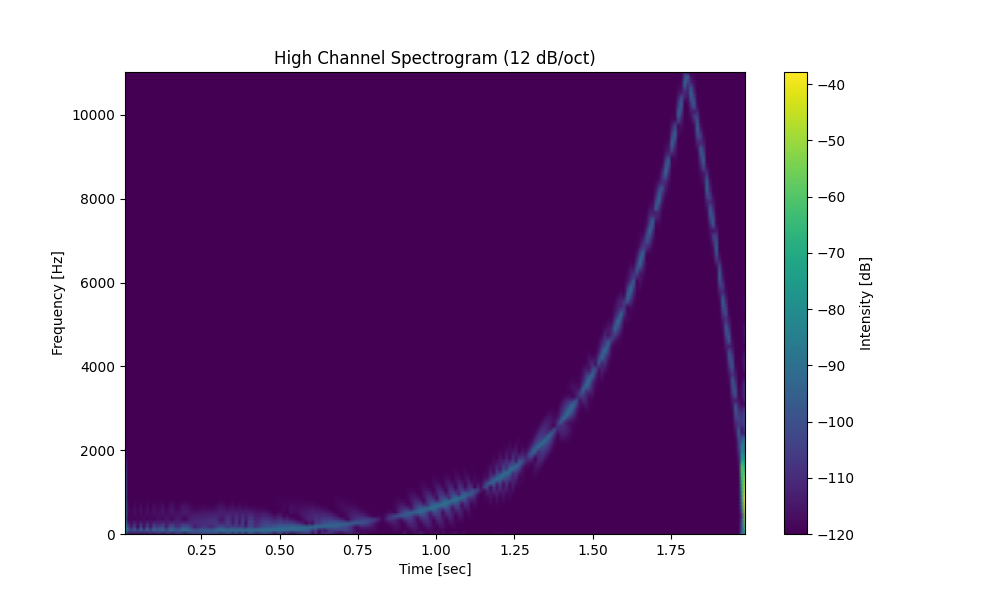
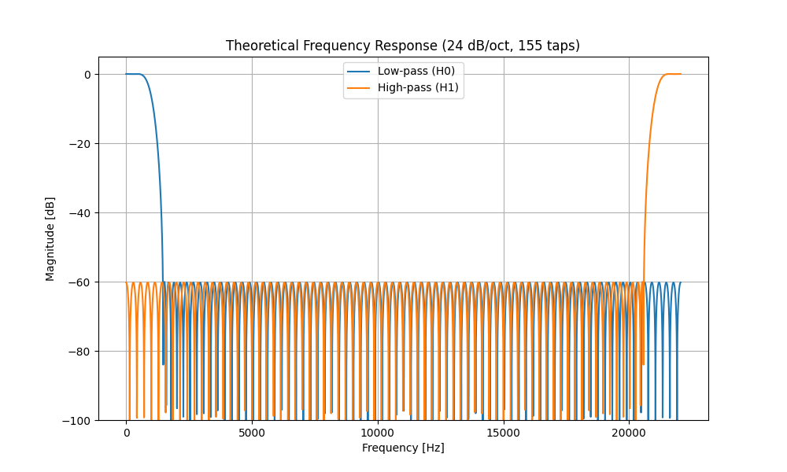
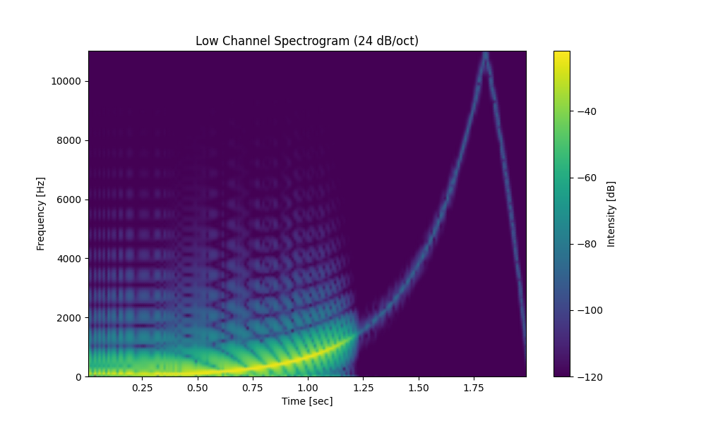
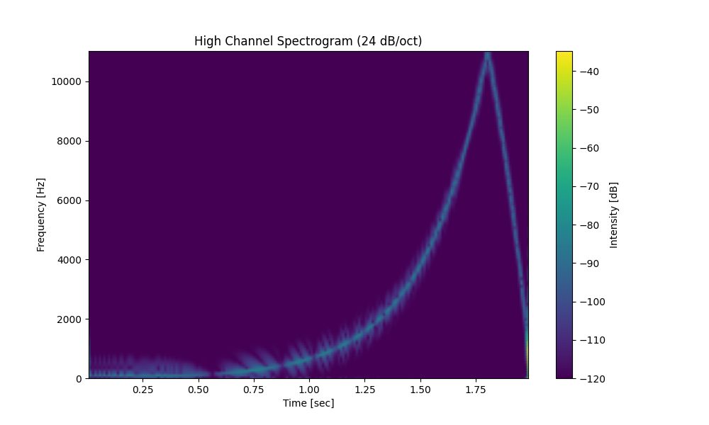
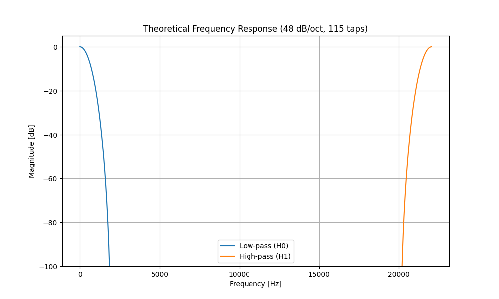
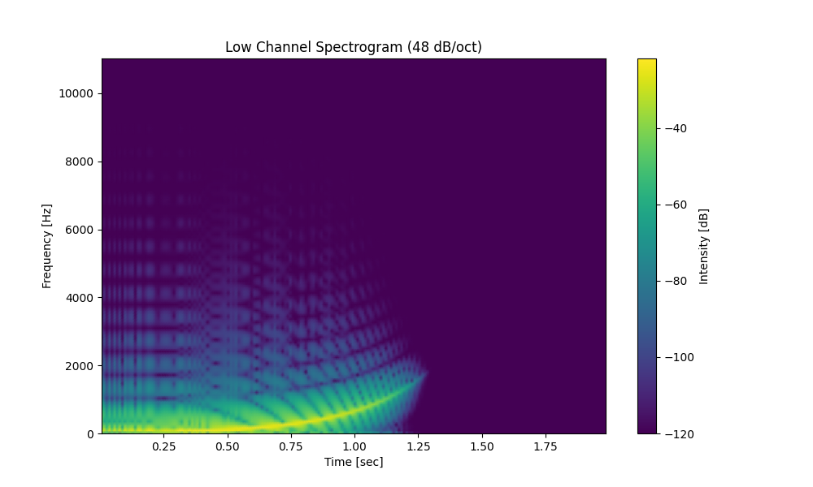
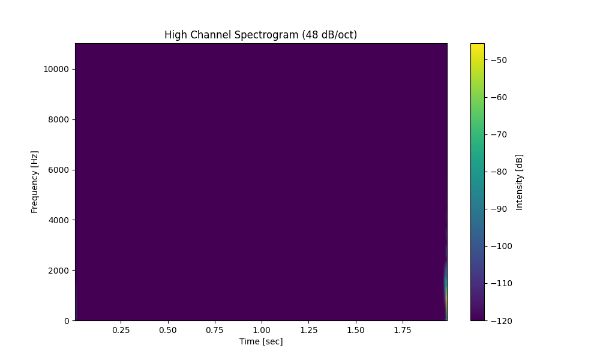

# QMF Filter Code Generator for ESP32/Arduino

This project provides a tool for designing 2-channel analysis Quadrature Mirror Filter (QMF) / cosine-modulated filter-banks for ESP32 and Arduino platforms. It includes a Python generator that emits ready-to-use C++ code and a mock testing system to verify the filter performance in Python.

## Features

- **Optimal Filter Design**: Uses the Remez exchange algorithm to design symmetric FIR filters.
- **ESP32 Optimized**: Generates C++ code that exploits linear-phase symmetry and uses IRAM (on ESP32) for fast execution.
- **Flexible Parameters**: Custom sample rates, crossover frequencies, target slopes, and stopband attenuation.
- **Python Mock System**: Test the generated filters in Python before deploying to hardware.
- **Signal Analysis**: Built-in signal generator and analyzer to plot frequency responses and spectrograms.

## Quick Start

### 1. Generate a Filter

```bash
python3 esp32_qmf_gen4.py --fs 44100 --crossover-hz 1000 --target-slope-db-per-oct 24 --stopband-db 60 --max-taps 255 --output qmf_24.h
```

### 2. Test in Python

Use the `MockQMF2` class in `mock_qmf.py` to simulate the filter:

```python
from mock_qmf import MockQMF2
import numpy as np

# Load taps from generated .h or .json
taps = 155
h0 = [...]
qmf = MockQMF2(taps, h0)

# Process a sample
low, high = qmf.process(0.5)
```

## Demonstrations

We have demonstrated three different filter configurations at a lower crossover frequency (1000 Hz) to show the principles behind the system. All tests were performed at a sample rate of 44.1 kHz.

### 1. 12 dB/oct Filter (127 Max Taps)

At a 1000 Hz crossover, more taps are required compared to a 10 kHz crossover. This 61-tap filter achieves the target slope with good stopband attenuation.





### 2. 24 dB/oct Filter (255 Max Taps)

By increasing the tap search range up to 255, the generator found a 155-tap filter that provides a sharper transition at 1000 Hz.





### 3. 48 dB/oct Filter with Half Tap Search (127 Max Taps)

This demonstration shows the principles of the system at a lower crossover: attempting to achieve a very steep 48 dB/oct slope with restricted taps (127 max). Since 1000 Hz is quite low relative to 44.1 kHz, the generator uses more taps (115 in this case) compared to higher crossovers, but still struggles to match the extremely sharp 48 dB/oct target within these constraints.





## Testing and Graphing System

The project includes `qmf_test_system.py`, which provides a complete environment for generating test signals (sine sweeps, noise), processing them through the mock Arduino system, and generating the plots shown above.

**This system is left for the user to explore and adapt for their own filter designs.**

## Files in this Repository

- `esp32_qmf_gen4.py`: The main filter generator script.
- `mock_qmf.py`: Python implementation of the generated C++ filter logic.
- `qmf_test_system.py`: Signal generator, analyzer, and graphing system.
- `*.h`: Generated C++ header files for Arduino.
- `*.json`: Metadata for the designed filters.
